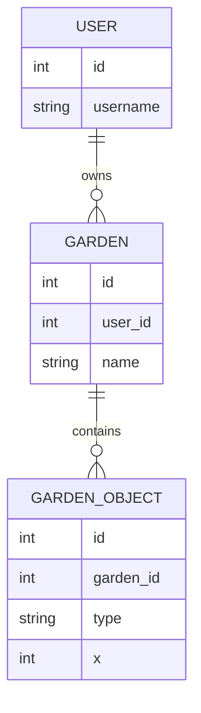
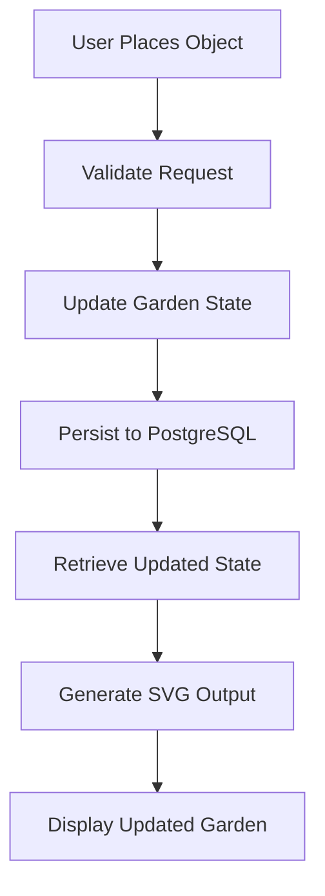

# Zen Garden — System Design Overview

Zen Garden is a server-backed application that allows users to create, modify, and persist custom garden layouts.

The primary challenge is maintaining a consistent representation of user-designed layouts while translating stored state into dynamic visual output.

---

## System Goals

- Persist user-created garden layouts across sessions
- Support authenticated ownership of garden data
- Allow incremental modification of layouts
- Generate visual representations directly from stored state
- Keep rendering deterministic and reproducible

---

## High-Level Architecture

Zen Garden follows a traditional web application architecture where the database serves as the source of truth.

### Core Components

- Frontend Interface
  - Displays garden layouts
  - Collects user actions

- Application Layer (Node.js)
  - Validates requests
  - Applies garden modifications
  - Manages authentication and ownership

- Persistence Layer (PostgreSQL)
  - Stores user accounts
  - Stores garden layouts
  - Stores placed objects and coordinates

- Rendering Layer
  - Converts stored garden state into SVG output
  - Regenerates visuals from database state

---

## State Model

The system is organized around several persistent entities:

Each object contains:

- Position
- Type
- Visual attributes
- Ownership relationship

The database acts as the canonical representation of every garden.

---

## Request Flow

A typical interaction follows this pipeline:

1. User places an object
2. Request is sent to the server
3. Application validates ownership and input
4. Database state is updated
5. Updated garden state is retrieved
6. SVG representation is regenerated
7. New layout is displayed

This ensures visual output always reflects persisted state.

---

## Key Design Decisions

### 1. Database as Source of Truth

The rendered garden is never treated as authoritative.

Visual output is derived entirely from stored state.

---

### 2. State-Driven Rendering

SVG generation is based on database records rather than manually maintained visual state.

This guarantees deterministic rendering.

---

### 3. Ownership-Based Access

Garden layouts are associated with authenticated users.

All modifications are validated against ownership rules.

---

### 4. Separation of Persistence and Presentation

The application stores garden data independently of how it is rendered.

The rendering layer can evolve without changing the underlying state model.

---

## Why This Project Matters

Zen Garden demonstrates:

- CRUD application architecture
- relational data modeling
- authenticated user ownership
- state persistence
- server-side rendering concepts
- transformation of structured state into visual output

---

## Summary

Zen Garden is a state-driven application where user actions modify persistent data that is subsequently transformed into a visual representation.

The project focuses on maintaining consistency between stored state and rendered output while supporting authenticated multi-user interaction.
